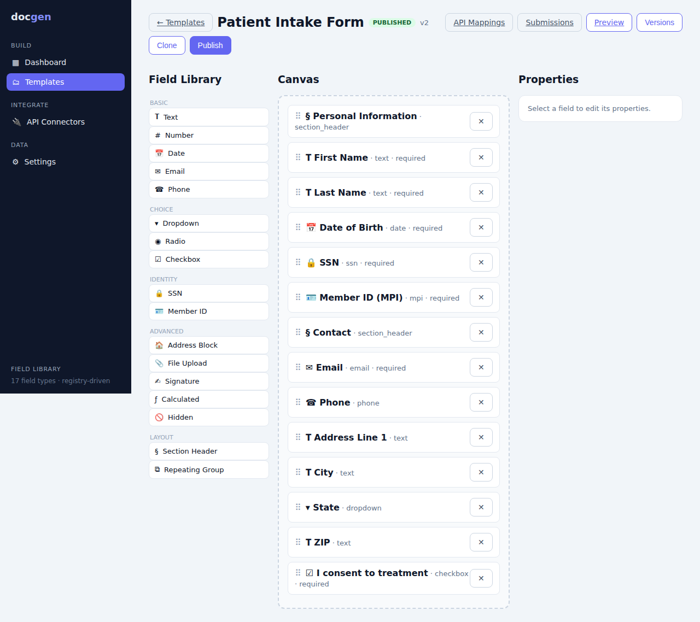

# docgen — Doc4j-style Form Builder Platform

A flexible, extensible, cloud-agnostic platform for visually building forms/document
templates, connecting fields to REST APIs, auto-prefilling data, and managing reusable,
versioned templates. Spring Boot (Java) backend + React (TypeScript) frontend on PostgreSQL.



## Features

- **Visual form builder** — persistent sidebar, drag-and-drop canvas, field property panel,
  live preview, save draft, publish, clone, version history.
- **17 field types** — text, number, date, dropdown, checkbox, radio, file upload, address,
  SSN, MPI/Member ID, email, phone, signature, calculated, hidden, section header, repeating group.
- **Template system** — JSON schema + layout + validation + role access, conditional visibility,
  versioning, publish/unpublish, multiple categories (intake, member registration, eligibility, …).
- **API prefill engine** — configurable connectors + JSONPath→field mappings with transforms,
  fallbacks, required enforcement, and rate limiting.
- **Security** — JWT/OAuth2-ready, AES-GCM encryption at rest, SSN/MPI field masking,
  server-side validation, audit logging.
- **Extensible by design** — field registry (frontend) + validator strategy registry (backend),
  plugin-style connectors, JSON-schema-driven rendering, metadata-driven config.

See [docs/ARCHITECTURE.md](docs/ARCHITECTURE.md) for the system design, patterns and extension
points, and [docs/API.md](docs/API.md) for the REST contracts.

## Tech stack

| Layer    | Tech |
|----------|------|
| Backend  | Java 21 (LTS)¹, Spring Boot 3.5, Spring Data JPA, Flyway, JJWT, JSONPath, springdoc-openapi |
| Frontend | React 18, TypeScript, Vite, React Router, TanStack Query, dnd-kit, Zustand, Axios |
| Data     | PostgreSQL 16 (JSONB columns), Redis (optional, for prefill rate limiting) |

¹ The codebase only uses features common to Java 21+ (records, sealed types, pattern matching,
virtual threads). To target **Java 25**, change `<java.version>` in `backend/pom.xml` and build
with a JDK 25 toolchain.

## Quick start

### 1. Start PostgreSQL (and optional Redis)

```bash
docker compose up -d        # postgres on :5432, redis on :6379
```

No Docker? Point the backend at any PostgreSQL via `DB_URL`, `DB_USERNAME`, `DB_PASSWORD`.

### 2. Run the backend

```bash
cd backend
./mvnw spring-boot:run
```

- Flyway creates the schema and seeds demo data (2 templates, a connector, mappings).
- Swagger UI: http://localhost:8080/swagger-ui.html
- Health: http://localhost:8080/actuator/health

Run the tests:

```bash
cd backend && ./mvnw test
```

### 3. Run the frontend

```bash
cd frontend
npm install
npm run dev          # http://localhost:5173  (proxies /api to :8080)
```

Open http://localhost:5173, go to **Templates → Patient Intake Form → Build**, drag fields,
then **Preview**, click **Run prefill**, and **Submit**.

## Demo credentials

The default `dev` profile is permissive (no login wall). A seeded admin exists for JWT testing:

```
email:    admin@docgen.local
password: password
```

`POST /api/auth/login` returns a JWT; send it as `Authorization: Bearer <token>`. The admin holds
the `DATA_UNMASK` role, so it sees unmasked SSN/MPI values; anonymous/other callers see masked.

## Configuration

| Env var | Default | Purpose |
|---------|---------|---------|
| `DOCGEN_PROFILE` | `dev` | `dev` (open) or `prod` (auth + role-gated) |
| `DB_URL` / `DB_USERNAME` / `DB_PASSWORD` | local postgres | Database connection |
| `REDIS_HOST` / `REDIS_PORT` | localhost:6379 | Optional cache for rate limiting |
| `JWT_SECRET` | dev key | Base64 256-bit HMAC secret — **override in prod** |
| `DOCGEN_AES_KEY` | dev key | Base64 AES-256 key for encryption at rest — **override in prod** |

## Deployment

Cloud-agnostic: the backend is a standard Spring Boot jar (`./mvnw package`) and the frontend is
static assets (`npm run build`). Run on bare metal, Docker, Kubernetes, AWS, GCP or Azure — supply
a managed PostgreSQL and (optionally) Redis via the env vars above.
